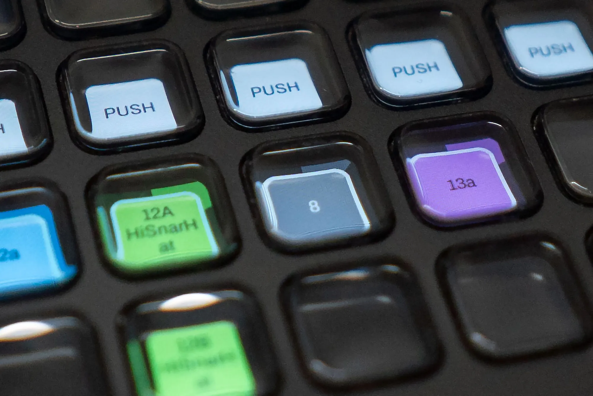

# ClipDeck

Display and launch Ableton Live Clips on Elgato Stream Deck devices. Tested on macOS only.



## Project Docu & Links

There is a video explaining the basic functionality here: https://youtu.be/JUXHXXyj_Ss

You can find more information at: https://jakobkilian.de/clipdeck/

## Architecture Overview

ClipDeck consists of two main components:

1. **ClipDeck (CD)** - External Python script (`clipdeck.py`)
   - Manages Stream Deck hardware (display, button input)
   - Runs outside of Ableton and communicates via OSC
   
2. **Control Surface (CS)** - Ableton Remote Script (`ClipDeck_CS/`)
   - Runs inside Ableton Live's Python environment with direct API access
   - Sends clip info to CD, receives trigger commands
   - **You can have multiple of these** with separate session rings (one per Stream Deck)

---

## Installation

### 1. Clone/Download Repository

clone or download and extract to:

 `~/Music/Ableton/User Library/Remote Scripts/ClipDeck/`

### 2. Install System Dependencies

```bash
brew install hidapi
```

### 3. Install Python Dependencies

Using a virtual environment (recommended):
```bash
cd ClipDeck
python3 -m venv .venv
source .venv/bin/activate
pip install -r requirements.txt
```

Or install globally:
```bash
pip install -r requirements.txt
```

### 4. Set Up Control Surface(s)

1. **Copy** `ClipDeck_CS/` folder **outside** of the ClipDeck directory to the Remote Scripts root level
2. **Rename** the copy to something descriptive (e.g., `ClipDeck_Left`)
3. **Duplicate** for each additional Stream Deck (e.g., `ClipDeck_Right` or `ClipDeck_Two`)

Your folder structure should look like:
```
Remote Scripts/
├── ClipDeck/              # The repo (CD runs from here)
├── ClipDeck_Left/         # First CS (copied from ClipDeck_CS)
├── ClipDeck_Right/        # Second CS (another copy)
└── ...
```

### 5. Configure Ableton

1. Open **Ableton Live** → Preferences → Link, Tempo & MIDI
2. In the **Control Surface** dropdowns, select your CS scripts:
   - Slot 1: `ClipDeck_Left`
   - Slot 2: `ClipDeck_Right` (if using 2 or more decks)
3. Leave **Input/Output as "None"** (communication is via OSC, not MIDI)
4. **Restart Ableton**

---

## Configuration (First Run)

Run ClipDeck with the `settings` argument:

```bash
# With virtual environment:
source .venv/bin/activate
python clipdeck.py settings

# Or directly:
.venv/bin/python clipdeck.py settings
```

### Configuration Options

1. **Debug Mode** (ON/OFF)
   - Logs OSC messages to debug ports (10000, 10010)
   - Prints logs to terminal and Ableton's Log.txt

2. **Default Brightness** (0-10)
   - Initial Stream Deck brightness

3. **Scroll Mode:**
   - `1. none` - No scrolling buttons
   - `2. vertical` - Up/Down arrows (bottom right corner)
   - `3. both` - Burger menu with 4-way arrows + brightness control
   - `4. both-reset` - Like both, but left arrow resets to default horizontal offset

4. **Deck Settings:**
   - Each connected deck lights up for identification
   - Set **display order** (1-10, or 0 to skip)
   - Set **horizontal offset** (which track column to start from)

Settings are saved to `deck_config.json` and loaded automatically on subsequent launches.

---

## Regular Use

Once configured, run without arguments:

```bash
# With virtual environment:
.venv/bin/python clipdeck.py

# Or if venv is activated:
python clipdeck.py
```

**Tip:** On macOS, use Automator to create a dock app that launches the script.

### Behavior

- ✅ Auto-connects to Ableton when it comes online
- ✅ Handles Ableton project switches
- ✅ Press **'c'** to cleanly exit (clears all buttons to black)
- ❌ Does **not** survive Stream Deck disconnect — restart CD if unplugged

---

## Scroll Mode Controls

### None (Option 1)

session ring is fixed and can not be scrolled

### Vertical Mode (Option 2)

- **arrow up:** Scroll up (scenes)
- **arrow down:** Scroll down (scenes)

### Both / Both-Reset Mode (Options 3 & 4)
Hold **Key 31 (burger menu)** to reveal controls:
- **arrow up:** Scroll up (scenes)
- **arrow down:** Scroll down (scenes)
- **arrow left:** Scroll left (tracks) **or** reset in (both-reset mode)
- **arrow right** Scroll right (tracks)
- **sun icon:** Brightness (short press = cycle up 0-10, long press = reset to default)

---

## OSC Protocol Reference

CD and CS communicate via UDP on `127.0.0.1`.

### Port Assignment

Based on `display_order` (0, 1, 2...). Make sure these ports are free on your machine
| Direction | Port Formula | Examples |
|-----------|--------------|----------|
| CD → CS   | `9001 + (order × 10)` | 9001, 9011, 9021 |
| CS → CD   | `9000 + (order × 10)` | 9000, 9010, 9020 |
| Debug     | `send_port + 1000` | 10000, 10010 |

### Messages: CD → CS

| Address | Arguments | Description |
|---------|-----------|-------------|
| `/pyonline` | — | CD announces it's online |
| `/config` | `display_order, h_offset, debug_mode` | Send configuration |
| `/trigger_clip` | `track_offset, scene_offset` | Trigger a clip |
| `/scroll` | `direction` | "up", "down", "left", "right", "reset" |
| `/refresh` | — | Force full clip info update |

### Messages: CS → CD

| Address | Arguments | Description |
|---------|-----------|-------------|
| `/ablonline` | `display_order` | CS announces it's online |
| `/clip_info` | `display_order, key, name, color, progress` | Clip state update |
| `/track_stopped` | `display_order, track_index, was_playing` | Track stopped (red flash) |
| `/structural_mismatch` | `display_order, show` | Not enough tracks |
| `/document_closing` | `display_order` | Ableton project closing |
| `/config_request` | `display_order` | CS requests config |

---

## Development Notes

### Reload CS Without Restarting Ableton

1. Install **Ableton Beta**
2. Create [options.txt](https://help.ableton.com/hc/en-us/articles/6003224107292-Options-txt-file)
3. Add line: `-_ToolsMenuRemoteScripts`
4. Restart Ableton once
5. Reload scripts: **Shift + Option + Cmd + R** (Mac)

### Useful Tools

- **Log Viewer** (macOS): Live view `~/Library/Preferences/Ableton/Live VERSION/Log.txt`
- **Protokol**: Monitor OSC messages on debug ports

---

## License

*I am undecided on how to distribute ClipDeck. Feel freeto use it for free. There might be a future version that I release as a paid software.*

**Copyright © 2026 Jakob Kilian. All Rights Reserved.**

This software is proprietary. No permission is granted to use, copy, modify, or distribute without explicit written permission from the copyright holder.

See [LICENSE](LICENSE) for full terms. See [THIRD_PARTY_LICENSES.md](THIRD_PARTY_LICENSES.md) for bundled dependency licenses. 

